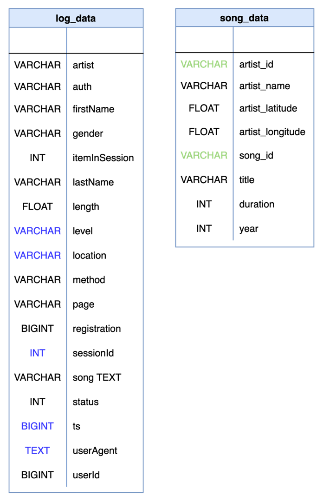
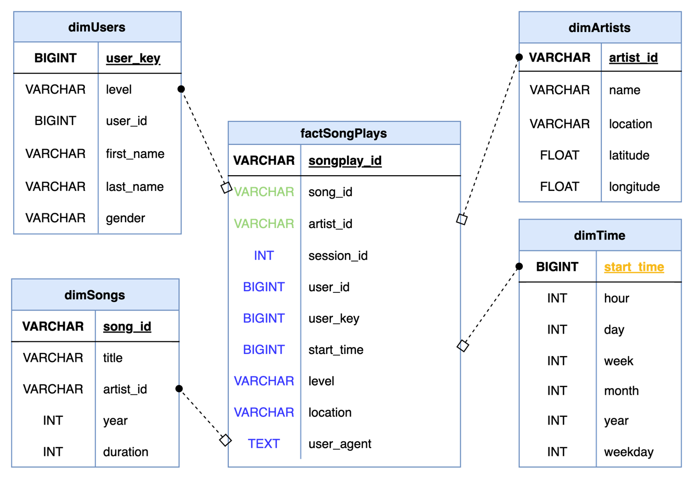

# ProjectDataWarehouse

The project contains the scripts used to manage two data sets:
- a database containing a record of published song data
- a log from a music streaming service

The first step was to create staging tables and a set of tables in the star schema.

Specifically below is a diagram of the two staging tables.

The goal of the project was to transfer the data into Fact (1) and Dimension (2) tables as pictured below.

The Fact table is called factSongPlays.

There are four Dimension tables. The dimUsers table contains information about the users of the music streaming service; the dimSongs table, about the songs; and the dimArtists, about the musical artists. The dimTime table contains a component breakdown of the datetime information extracted from the unique millisecond epoch start time (start_time) that is logged every time a user interacts with the music steaming service platform. 

An noteworthy oberservation: a unique user_key had to be generated instead of using the extracted user_id. During EDA (Exploratory Data Analysis), it was discovered that the logging system tracked logged out events which didn't have a user_id associated with it. 

EDA didn't reveal any inconsistencies with uniques for the other Dimension tables. Consequently, those three tables (dimSongs, dimArtists, dimTime) utilized keys extracted from the two staging tables.

Below is a diagram of the log_data and song_data tables:

